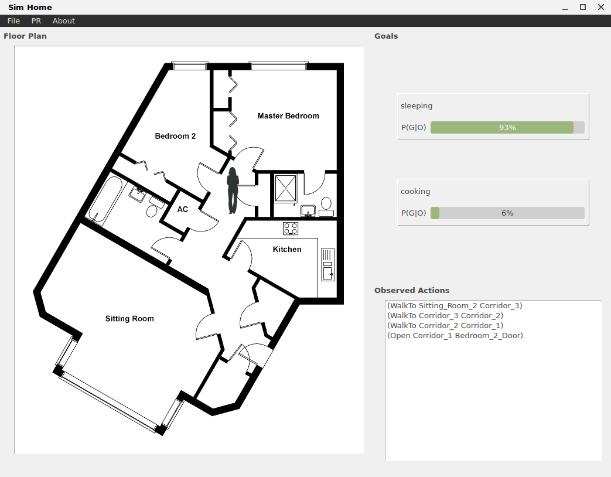

# Goal/Plan Recognition as Planning Demo

Demo for Plan Recognition as Planning over Classical Action Theories.

A person is observed doing things in a house. The Goal Recognition system computes the probability of each potential goal that the agent may be pursuing.

## Pre-requisites

The demo requires:

 1. The sources of the automated planning toolkit [LAPKT](https://github.com/LAPKT-dev/LAPKT-public), which you will need to clone.
    * A snapshot is already included in `extras/LAPKT-public`
 2. The Qt4 development libraries.  Note that latest versions of Ubuntu come with Qt5 pre-installed. Getting Qt4 installed 'alongside' Qt5 is trivial in Ubuntu 16.04, all is needed is the following command
 ```
 $ sudo apt install libqt4-dev qt4-dev-tools
 ```


## Build procedure for base demo

This is the original demo.

First of all, compile to produce the LAPKT library `lapkt-lib/liblapkt.a` by going into folder `lapkt-lib/` and issuing the command `scons`. This will use the LAPKT source snapshops in `../extras/LAPKT-public` and produce the binaries for the planning algorithms needed by the demo.

Second, we can compile the demo either via QMAKE or CMAKE.

### Build via QMAKE

1. In the root folder of the project, produce the `Makefile` script via:
    * `qmake -o Makefile sim-home.pro` (if you have just Qt4 installed in your system)
    * `qmake-qt4 -o Makefile sim-home.pro` (if you have both Qt4 and Qt5 installed in your system)
2. Build the app with ```make```.
3. Binary `./sim-house` will be created and all temp build files will remain in `.build/`


### Build via CMAKE

1. Get into a directory to build: `mkdir build ; cd build`
2. Run CMAKE to generate building files: `cmake ..`
3. Compile using `make`
4. Run sim-house: `cd .. ; ./build/sim-house`
    * Note working directory has to be the root directory (not `build/`).
    
    
    


## Demo with AI2THOR

This is the demo using [AI2THOR](https://ai2thor.allenai.org/) as in [this repo](https://github.com/nirlipo/pr-as-planning-demo).


### Pre-requisites

The demo requires:

 1. The sources of the automated planning toolkit [https://github.com/LAPKT-dev/LAPKT-public](LAPKT), which you will need to clone.
 2. The Qt4 development libraries.  Note that latest versions of Ubuntu come with Qt5 pre-installed. Getting Qt4 installed 'alongside' Qt5 is trivial in Ubuntu 16.04, all is needed is the following command
 ```
 $ sudo apt install libqt4-dev qt4-dev-tools
 ```


### Build procedure

Some quick and dirty instructions to build this project:

 1. go into the folder lapkt-lib and edit the script SConstruct, changing the paths in lines 18-19 so they point to the location where you cloned LAPKT-public,

 2. issue the command 'scons', this will produce the binaries for the planning algorithms needed by the demo,

 3. go back into the root folder of the demo sources and edit line 10 of the  sim-home.pro file, changing the references to LAPKT-public as appropiate,

 4. issue the command ```qmake``` (or ```qmake-qt4``` if you have *both* Qt4 and Qt5 installed in your system). This will produce a working Makefile script,

 5. build the app with ```make```.

### Sending Action from File

Got to file in folder

```
thor/observations.log
```

and add an action, save it, and if the simhome application is running, and the action is applicable, then it will change the main view. If you want to see the observation, first click in "start observing file menu option".

If you want to send another action, remove the action in observations.log write the new action, save the file, and it will be read automatically again.

In the file

```
thor/available_actions.log
```

you can see the actions available once you load a home.xml file.


### Thor simulation

The Thor 3D home simulation include three parts:
1. Sim-Home application
2. Thor 3D home Unity file
3. Python keyboard controller

The python controller will be used to control the agent working around the 3D Home and reports back the monitored action(through thor/observations.log) to the Sim-Home applicaton.


#### Sim-Home Application
Steps to run Sim-Home:
1. ./sim-home to open the application
2. load the 2D home file called event_demo.xml
3. Add some goals you want to track, you can find the example goals at thor/Goals.txt
4. Click start Observation 

#### Thor 3D home Unity file

This file contain the 3D unity home, please place this file under the folder "/thor". The file size is about 500MB and it's not include in the repository.

#### Python keyboard controller

1. Install the python3 library

```shell
$ pip3 install pynput ai2thor inquirer Shapely
```

2. Run the keyboard controller:

```shell
$ python3 keyboard.py
```

3. The unity screen should come out

4. Controll the agent through the following command:

* `WASD` for moving around
* `t` for turn on/off the objects like TV, laptop, lightswitch
* `p` for pick up the objects like pan, book, credit card
* `o` for open and close the objects like door, fridge door
* `m` for move hand forward.
* `Up` and `Down` arrows to move head up and down.
* `Left` and `Right` arrows to rotate left and right.


